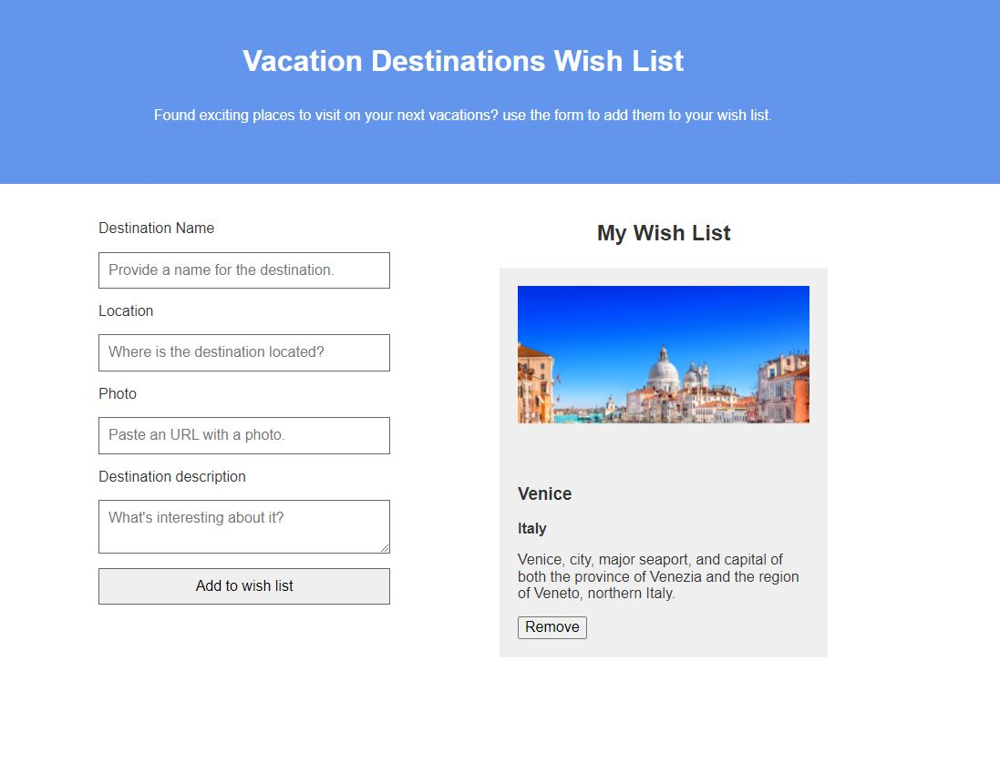

# Vacation_Destination_WishList
Small web application that allows the user to put together a list of holiday destinations. The programming was done in plain JS. 
Work done for the JavaScript Basics course at the University of California, Davis.

